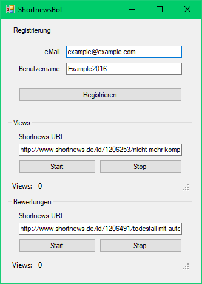

# ShortnewsBot
ShortnewsBot was a simple bot developed in .NET 4 to create accounts and generate views/votes. Developed around 2015/2016 with support for Socks5/Tor proxies. Since shortnews.de shutdown in 2018, this project is no longer maintained.

